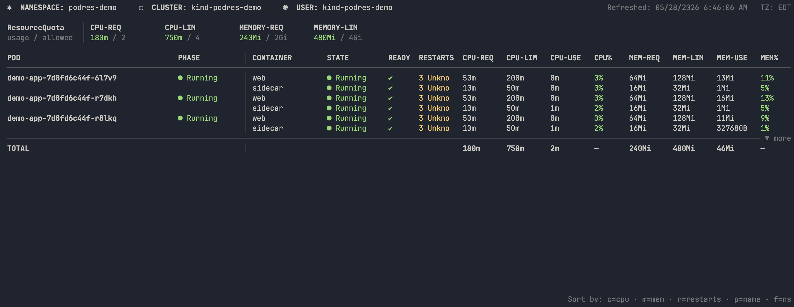

# podres

A `kubectl` (or `oc`) plugin that shows a real-time, colorized view of Kubernetes pod and container resource requests, limits, and live utilization in a single compact table. Works with any Kubernetes or OpenShift cluster.



## Prerequisites

- A running Kubernetes or OpenShift cluster
- [metrics-server](https://github.com/kubernetes-sigs/metrics-server) installed in the cluster (for live CPU/memory usage)
- `kubectl` configured with a valid kubeconfig

## Installation

### One-line install (Linux and macOS)

```bash
curl -sSL https://raw.githubusercontent.com/tadamo/podres/main/install.sh | bash
```

To pin a specific version:

```bash
curl -sSL https://raw.githubusercontent.com/tadamo/podres/main/install.sh | VERSION=v1.0.1 bash
```

### Clone and install

Clone the repo and run the install script directly (useful if you prefer to inspect before running):

```bash
git clone https://github.com/tadamo/podres.git
cd podres
./install.sh
```

### Direct download

Download the binary for your platform from the [releases page](https://github.com/tadamo/podres/releases), rename it to `kubectl-podres`, and place it somewhere on your `PATH`.

### Build from source

```bash
go install github.com/tadamo/podres@latest
```

Or clone and build manually:

```bash
git clone https://github.com/tadamo/podres.git
cd podres
go build -o kubectl-podres ./main.go
sudo mv kubectl-podres /usr/local/bin/kubectl-podres
```

### Plugin discovery

All installation methods place the binary at `kubectl-podres` somewhere on your `$PATH`. Both `kubectl` and `oc` automatically discover any executable named `kubectl-<something>` on the path — no registration needed. You can verify the plugin is found with:

```bash
kubectl podres --version
oc podres --version
```

## Usage

```bash
# Watch the current namespace (refreshes every 5s)
kubectl podres

# Watch a specific namespace
kubectl podres -n kube-system

# Watch pods across all namespaces
kubectl podres -A

# Filter by label selector
kubectl podres -l app=nginx

# One-shot snapshot (no watch mode)
kubectl podres --no-watch

# Custom refresh interval
kubectl podres --interval 10s

# Show full pod/container names without truncation
kubectl podres --wide

# Start sorted by CPU usage (descending)
kubectl podres --sort cpu
```

## Flags

| Flag | Default | Description |
|---|---|---|
| `-n, --namespace` | current context | Namespace to watch |
| `-A, --all-namespaces` | `false` | Watch pods across all namespaces |
| `-l, --selector` | | Label selector to filter pods (e.g. `app=nginx`) |
| `--interval` | `5s` | Refresh interval in watch mode |
| `--no-watch` | `false` | Print once and exit |
| `--kubeconfig` | `~/.kube/config` | Path to kubeconfig |
| `--context` | current context | Kubeconfig context to use |
| `--threshold-warn` | `75` | Yellow warning threshold (percent) |
| `--threshold-crit` | `95` | Red critical threshold (percent) |
| `--no-color` | `false` | Disable colorized output |
| `--pod-dividers` | `false` | Draw a horizontal rule between each pod |
| `-w, --wide` | `false` | Show full pod and container names without truncation |
| `--sort` | | Initial sort column: `cpu`, `mem`, `restarts`, `name`, `namespace` |

> `--all-namespaces` and `--namespace` are mutually exclusive. `--threshold-warn` must be less than `--threshold-crit`.

## Keyboard shortcuts (watch mode)

| Key | Action |
|---|---|
| `c` | Sort by CPU% |
| `m` | Sort by Memory% |
| `r` | Sort by restart count |
| `p` | Sort by pod name |
| `n` | Sort by namespace (all-namespaces mode only) |
| `0` | Clear sort (pressing a sort key again reverses direction) |
| `f` | Open namespace picker (switch namespace without restarting) |
| `↑` / `↓` | Scroll |
| `PgUp` / `PgDn` | Scroll by page |
| `q` / `Ctrl+C` | Quit |

### Namespace picker (`f`)

Pressing `f` opens an interactive namespace picker at the bottom of the screen. Type to filter the list, use `↑`/`↓` to navigate, press `Enter` to switch, and `Esc` to cancel. Press `*` to jump straight to the **All Namespaces** entry.

## Color coding

| Usage | Color | Symbol |
|---|---|---|
| < threshold-warn | Green | (none) |
| ≥ threshold-warn | Yellow | `⚠` |
| ≥ threshold-crit | Bold red | `‼` |

Threshold symbols (⚠ and ‼) are appended to the CPU% and MEM% values so threshold violations are visible even with `--no-color`.

Pods with non-zero restart counts are highlighted in yellow. OOMKilled restarts are shown in bold red. The abbreviated last-termination reason is shown alongside the restart count (e.g. `3 OOM`, `2 Err`).

Pods in `Succeeded` or `Failed` phase are dimmed to de-emphasize completed workloads.

## ResourceQuota

When a `ResourceQuota` is set on the namespace, podres displays a summary above the pod table showing CPU and memory request/limit usage against the quota. Usage values are threshold-colored just like the per-container columns.

The quota section is hidden when:
- Running in `--all-namespaces` mode (quota is per-namespace)
- A label selector (`-l`) is active (totals would not reflect the full namespace)

## License

Apache-2.0 — see [LICENSE](LICENSE)
